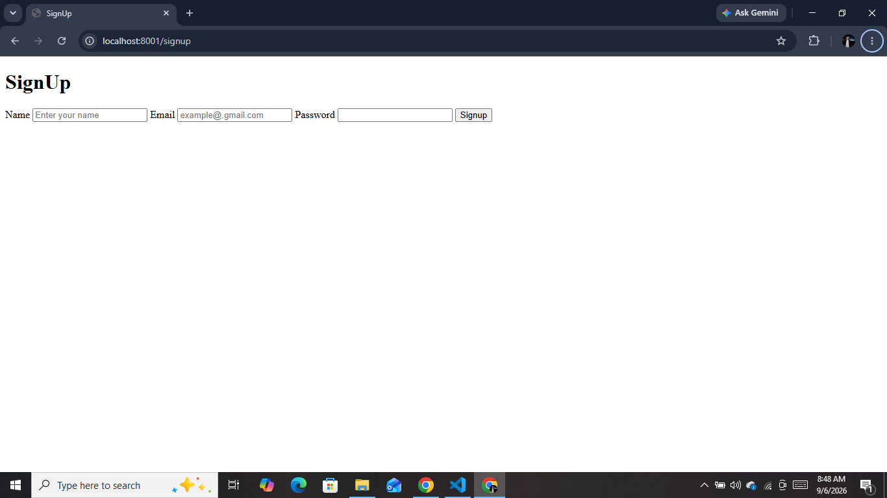
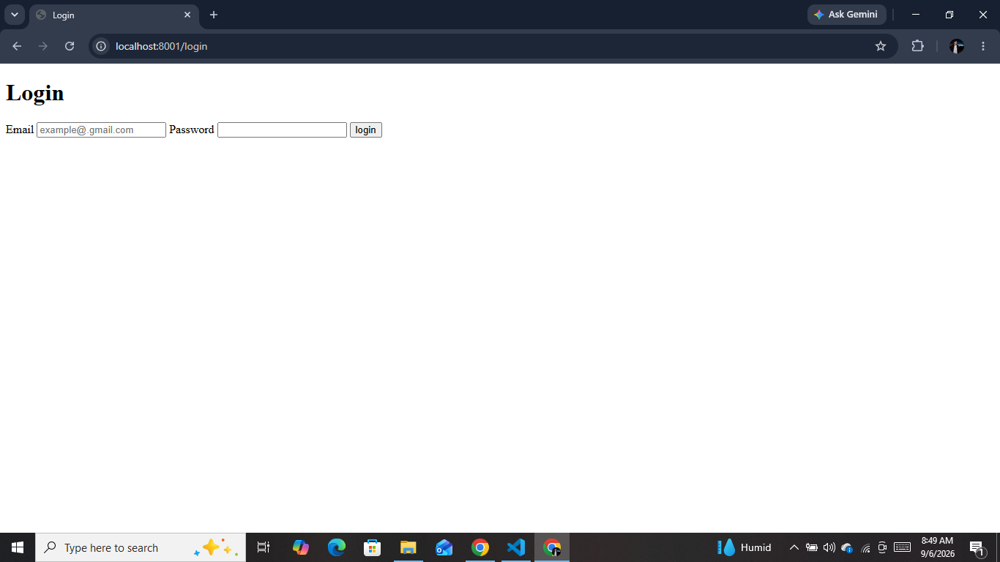
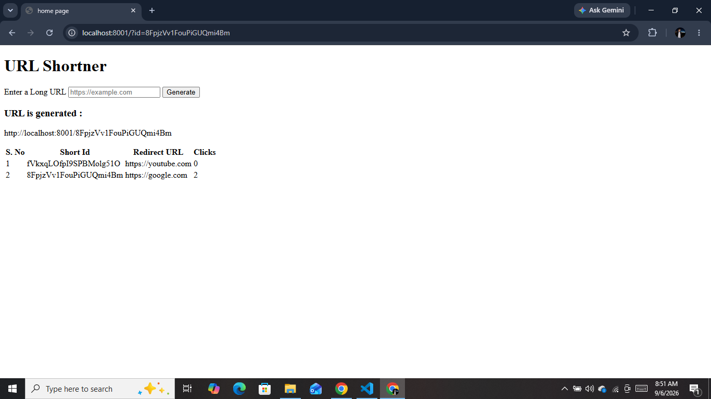
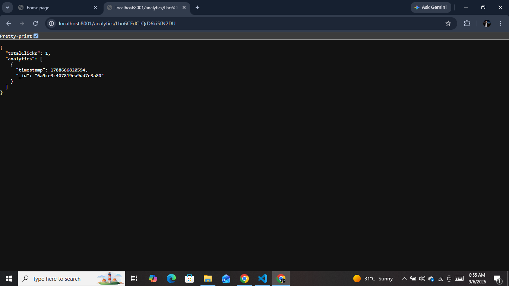
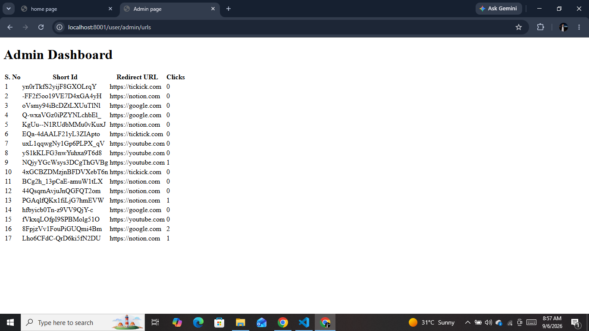

# 🔗 URL Shortener

A full-stack URL shortener built with **Node.js, Express, MongoDB, Mongoose, and EJS**.

The project allows authenticated users to create short URLs, redirect visitors through those URLs, and track click history. It also demonstrates **JWT-based authentication, role-based authorization, user-specific URL ownership, middleware, MVC-style organization, and MongoDB relationships**.

> **Note:** This project was built as a learning project while studying Node.js and backend development. Some production-level security hardening is intentionally left as future improvement.

---

## 📌 Features

* User signup and login
* JWT-based authentication
* Authentication through HTTP cookies
* Protected routes using Express middleware
* User-specific URL ownership
* Create short URLs using `nanoid`
* Redirect short URLs to their original destination
* Record every visit with a timestamp
* URL click analytics
* Admin-only URL dashboard
* Role-based authorization
* MongoDB database using Mongoose
* Server-side rendering with EJS
* Environment variables using `dotenv`
* Dynamic server port using `process.env.PORT`

---
## 📸 Screenshots

The following screenshots demonstrate the main user-facing pages and functionality of the application.

All screenshots are stored in the `screenshots/` directory of this repository. The relative image paths below allow GitHub to display the images directly from that folder.

### Signup



### Login



### User Dashboard



### User Analytics



### Admin Dashboard



## 🛠️ Tech Stack

### Backend

* Node.js
* Express.js
* MongoDB
* Mongoose

### Authentication

* JSON Web Tokens (`jsonwebtoken`)
* Cookies (`cookie-parser`)

### Frontend / Views

* EJS
* HTML

### Other Packages

* `nanoid` — generates unique short URL IDs
* `dotenv` — loads environment variables
* `nodemon` — development server

---

# 🏗️ Project Structure

```text
project-url-shortner/
│
├── controllers/
│   ├── url.js
│   └── user.js
│
├── middlewares/
│   └── auth.js
│
├── models/
│   ├── url.js
│   └── user.js
│
├── routes/
│   ├── staticRouter.js
│   ├── url.js
│   └── user.js
│
├── service/
│   └── auth.js
│
├── views/
│   ├── admin.ejs
│   ├── home.ejs
│   ├── login.ejs
│   └── signup.ejs
│
├── .gitignore
├── connection.js
├── index.js
├── package.json
├── package-lock.json

```

### Folder Responsibilities

**`controllers/`**

Contains the main application logic for users and URLs.

**`middlewares/`**

Contains authentication and authorization middleware.

**`models/`**

Contains Mongoose schemas and MongoDB models.

**`routes/`**

Defines the application's HTTP routes and connects them to controllers.

**`service/`**

Contains reusable authentication-related logic, including creating and verifying JWTs.

**`views/`**

Contains EJS templates rendered by Express.

---

# 🔄 How the Application Works

The application follows a basic flow:

```text
Browser
   ↓
Express Route
   ↓
Middleware
   ↓
Controller
   ↓
Mongoose Model
   ↓
MongoDB
   ↓
Response / EJS View
```

For example, when an authenticated user creates a short URL:

```text
User submits long URL
        ↓
POST /url
        ↓
Authentication middleware
        ↓
URL controller
        ↓
nanoid() generates short ID
        ↓
URL saved in MongoDB
        ↓
User redirected back to dashboard
```

---

# 🔐 Authentication

The project uses **JWT-based authentication**.

## 1. User Signup

A user submits:

* Name
* Email
* Password

The request is sent to:

```http
POST /user
```

The controller creates a new `User` document in MongoDB.

The user is then redirected to the login page.

---

## 2. User Login

The login form sends:

```http
POST /user/login
```

The controller searches MongoDB for a user whose email and password match the submitted credentials.

If the credentials are valid, a JWT is generated.

The JWT payload contains:

```js
{
  id: user._id,
  role: user.role
}
```

The token is then stored in a browser cookie:

```text
token
```

The browser automatically sends this cookie with subsequent requests.

---

# 🪪 JWT Authentication Flow

The authentication service contains two important functions:

### `setUser(user)`

Creates and signs a JWT.

```js
jwt.sign(payload, secret)
```

The secret comes from:

```text
process.env.JWT_SECRET
```

### `getUser(token)`

Verifies the JWT:

```js
jwt.verify(token, secret)
```

After verification, the application uses the ID from the JWT to find the user in MongoDB:

```js
User.findById(payload.id)
```

Therefore, in this implementation:

```text
Cookie
   ↓
JWT
   ↓
JWT verification
   ↓
User ID
   ↓
MongoDB User lookup
   ↓
req.user
```

The JWT is **signed, not encrypted**.

---

# 🛡️ Authentication Middleware

The project has two main authentication-related middleware functions.

## `checkForAuthentication`

This middleware runs globally.

It checks whether the request contains a `token` cookie.

If a valid token exists, the corresponding user is attached to:

```js
req.user
```

If there is no token or the token is invalid, the middleware simply allows the request to continue.

This makes it a **soft authentication check**.

---

## `restrictToLoggedInUserOnly`

This middleware is used when authentication is mandatory.

It verifies the token and finds the corresponding user.

If the user is not authenticated:

```text
redirect → /login
```

Otherwise:

```js
req.user = user
```

and the request continues.

This middleware protects the URL creation and home dashboard routes.

---

# 👥 Authorization and Roles

Authentication answers:

> "Who is the user?"

Authorization answers:

> "Is this user allowed to perform this action?"

The User schema contains a `role` field:

```js
role: {
  type: String,
  required: true,
  default: "NORMAL"
}
```

The project currently uses roles such as:

```text
NORMAL
ADMIN
```

The `restrictTo()` middleware checks whether the logged-in user's role is allowed.

For example:

```js
restrictTo(["ADMIN"])
```

means that only users with the `ADMIN` role can access that route.

---

# 👑 Admin Dashboard

The admin dashboard is available through:

```http
GET /user/admin/urls
```

This route is protected with:

```js
restrictTo(["ADMIN"])
```

The controller retrieves all URLs:

```js
Url.find({})
```

and renders:

```text
admin.ejs
```

A normal user attempting to access the admin route receives:

```text
Unauthorized
```

---

# 👤 User-Specific URL Ownership

Each URL document contains:

```js
createdBy
```

which references the `User` model.

Example:

```js
createdBy: req.user._id
```

When the home dashboard loads, it searches only for URLs belonging to the authenticated user:

```js
Url.find({
  createdBy: req.user._id
})
```

This means the normal dashboard does not simply display every URL stored in the database.

Instead:

```text
Logged-in User
      ↓
req.user._id
      ↓
createdBy
      ↓
Only that user's URLs
```

This demonstrates **resource ownership** in a backend application.

---

# 🔗 Creating a Short URL

A logged-in user submits a long URL to:

```http
POST /url
```

The route is protected by:

```js
restrictToLoggedInUserOnly
```

The controller:

1. Reads the URL from `req.body`
2. Checks that a URL was provided
3. Generates a unique short ID using `nanoid()`
4. Creates a MongoDB document
5. Associates the URL with the logged-in user
6. Redirects the user back to the home page

The stored document contains information such as:

```js
{
  shortId,
  redirectURL,
  visitHistory,
  createdBy
}
```

---

# ↪️ URL Redirection

When someone visits:

```http
GET /:shortId
```

the application searches MongoDB for the matching short ID.

If the URL exists, the application records a visit:

```js
$push: {
  visitHistory: {
    timestamp: Date.now()
  }
}
```

Then it redirects the visitor:

```js
res.redirect(updatedUrl.redirectURL)
```

So the flow is:

```text
Short URL
   ↓
Find URL in MongoDB
   ↓
Record visit timestamp
   ↓
Redirect to original URL
```

If the short URL does not exist:

```http
404
```

is returned.

---

# 📊 URL Analytics

Analytics are available through:

```http
GET /analytics/:shortId
```

The controller finds the URL by its `shortId`.

It calculates:

```js
const totalClicks = url.visitHistory.length;
```

and returns:

```json
{
  "totalClicks": 10,
  "analytics": [
    {
      "timestamp": 1750000000000
    }
  ]
}
```

The `visitHistory` array therefore acts as the project's click-tracking mechanism.

---

# 🗄️ Database Models

## User Model

The User schema contains:

```text
name
email
password
role
createdAt
updatedAt
```

The `role` defaults to:

```text
NORMAL
```

---

## URL Model

The URL schema contains:

```text
shortId
redirectURL
visitHistory
createdBy
createdAt
updatedAt
```

`shortId` is unique.

`createdBy` stores a MongoDB ObjectId reference to the User model.

This creates the relationship:

```text
User
 │
 └── createdBy
       │
       └── URL
```

---

# 🛣️ API Routes

## User Routes

| Method | Endpoint           | Purpose             | Protection |
| ------ | ------------------ | ------------------- | ---------- |
| POST   | `/user`            | Create a new user   | Public     |
| POST   | `/user/login`      | Login user          | Public     |
| GET    | `/user/admin/urls` | Admin URL dashboard | ADMIN only |

---

## URL Routes

| Method | Endpoint | Purpose          | Protection      |
| ------ | -------- | ---------------- | --------------- |
| POST   | `/url`   | Create short URL | Logged-in users |

---

## Static / Page Routes

| Method | Endpoint              | Purpose            | Protection       |
| ------ | --------------------- | ------------------ | ---------------- |
| GET    | `/`                   | User dashboard     | Logged-in users  |
| GET    | `/signup`             | Signup page        | Public           |
| GET    | `/login`              | Login page         | Public           |
| GET    | `/:shortId`           | Redirect short URL | Public           |
| GET    | `/analytics/:shortId` | View URL analytics | Currently public |

---

# 🌱 Environment Variables

The application uses environment variables for configuration.

Create a `.env` file:

```env
PORT=8001
MONGO_URL=your_mongodb_connection_string
JWT_SECRET=your_secret_key
```

### Important

The `.env` file should **never be committed to GitHub**.

The project `.gitignore` contains:

```gitignore
node_modules/
.env
```

---

# 🚀 Running Locally

## 1. Clone the repository

```bash
git clone https://github.com/shahzadgull46/nodejs-url-shortener.git
```

## 2. Enter the project

```bash
cd nodejs-url-shortener
```

## 3. Install dependencies

```bash
npm install
```

## 4. Create `.env`

Add:

```env
PORT=8001
MONGO_URL=your_mongodb_connection_string
JWT_SECRET=your_secret_key
```

### Run the application

For the normal Node.js server:

```bash
npm start
```

For development with automatic server restart using Nodemon:

```bash
npm run dev
```

The `npm start` command runs the application with Node.js, while `npm run dev` uses Nodemon to automatically restart the server when source files change.


# 🧪 Example Application Flow

A typical user journey looks like this:

```text
1. User opens /signup
          ↓
2. Creates an account
          ↓
3. User is redirected to /login
          ↓
4. User logs in
          ↓
5. JWT is stored in token cookie
          ↓
6. User opens /
          ↓
7. Authentication middleware identifies user
          ↓
8. User submits a long URL
          ↓
9. POST /url
          ↓
10. nanoid() creates short ID
          ↓
11. URL is saved with createdBy
          ↓
12. User receives short URL
          ↓
13. Visitor opens /:shortId
          ↓
14. Visit timestamp is recorded
          ↓
15. Visitor is redirected to original URL
```

---

# 🧠 Concepts Learned in This Project

This project was used to practice several important backend concepts:

### Node.js

* Node.js runtime
* CommonJS modules
* Environment variables
* File/project structure

### Express.js

* Express application
* Routes
* Route parameters
* Middleware
* Request/response handling
* `req.body`
* `req.cookies`
* Redirects
* Route protection

### MongoDB & Mongoose

* MongoDB connection
* Mongoose schemas
* Mongoose models
* CRUD operations
* ObjectId references
* Query filtering
* `$push`
* Document relationships

### Authentication

* Stateful vs stateless authentication
* Cookies
* Session concepts
* JWT
* JWT signing
* JWT verification
* Authentication middleware
* Authentication vs authorization

### Authorization

* User roles
* Role-based access control
* Admin routes
* Resource ownership

### Backend Architecture

* Controllers
* Routes
* Middleware
* Models
* Services
* MVC-style organization

### Debugging

During development, the project also involved debugging issues such as:

* Authentication flow
* JWT verification
* User roles
* MongoDB data
* User-specific URL filtering
* Route behavior
* URL generation and rendering

---

# 🔒 Security Considerations

This project is primarily a learning project, so some production-level security improvements remain.

### Password Storage

The current implementation stores and checks passwords directly rather than using a dedicated password hashing system.

For a production application, passwords should **never be stored as plaintext**.

A future version should use a password-hashing solution such as `bcrypt` and compare passwords using the appropriate password verification function.

### Cookie Security

The current JWT cookie is created without production-oriented cookie options such as:

```text
httpOnly
secure
sameSite
expiration
```

These should be configured appropriately before production deployment.

### URL Validation

The current URL creation controller checks that a URL value exists, but does not perform comprehensive server-side URL validation.

Additional validation should be added for a production application.

### Analytics Authorization

The current analytics endpoint:

```http
GET /analytics/:shortId
```

is public.

A future version could restrict analytics access to the URL owner or an administrator.

---

# 📈 Future Improvements

Possible improvements include:

* Password hashing
* Secure cookie configuration
* Better URL validation
* Protected analytics
* Logout functionality
* Better error handling
* Input validation
* Improved frontend styling
* Better success/error messages
* Expiring URLs
* Custom short IDs
* QR code generation
* Pagination for large URL lists
* More detailed analytics
* Production deployment configuration

---

# 📚 Project Purpose

This project was created to move beyond individual Node.js concepts and understand how those concepts work together inside a complete backend application.

The main learning areas were:

```text
Express
   +
MongoDB
   +
Mongoose
   +
Authentication
   +
Authorization
   +
Middleware
   +
MVC Structure
   +
EJS
   =
Complete Backend Application
```

The project demonstrates the transition from individual backend exercises toward building a structured application with authentication, database relationships, protected resources, and role-based access control.

---

# 👨‍💻 Author

**Shahzad Ahmad Gull**

GitHub: `shahzadgull46`

---

# 📄 License

This project was created as a learning project and is available for educational purposes.
